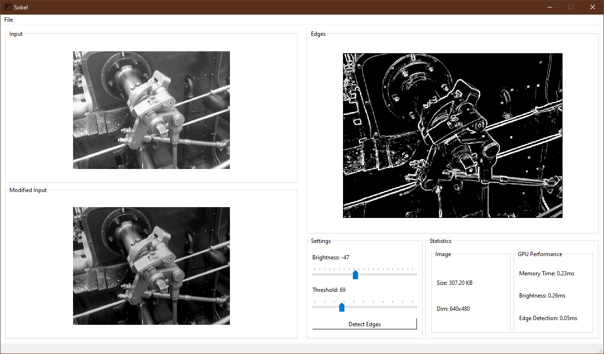

[![Optimized][Opt-CUDA]][cuda-url]
[![VS][VS]][VS19C]
[![Qt][Qt]][qt-url]
[![OpenCV][OCV]][ocv-url]

<!-- PROJECT LOGO -->
 

  

  <h3 align="center">Sobel - Edge Detector</h3>

  

    An edge detector app optimized for CUDA
     
    <a href="https://github.com/alihatamitajik/edge-detector-cuda/issues">Report Bug</a>
    ·
    <a href="https://github.com/alihatamitajik/edge-detector-cuda/issues">Request Feature</a>
  

<!-- ABOUT THE PROJECT -->
## About The Project

This project uses CUDA toolkit to create an edge detector based on Sobel filter.
Three methods were used for the implementation and comparison can be found in the
final [Report](./Report/report.pdf).

### Built With

These technologies are used for this project:

* CUDA
* Qt
* OpenCV

<!-- CONTACT -->
## Contact

Ali Hatami - [@alihatamitajik](https://twitter.com/alihatamitajik) - a\[DOT\]hatam008\[AT\]gmail.com

<!-- MARKDOWN LINKS & IMAGES -->
<!-- https://www.markdownguide.org/basic-syntax/#reference-style-links -->
[cuda-url]: https://developer.nvidia.com/cuda-toolkit
[Opt-CUDA]: https://img.shields.io/badge/%20-CUDA%20Toolkit-559?style=for-the-badge&logo=NVIDIA
[VS]: https://img.shields.io/badge/%20-Visual%20Studio-blue?style=for-the-badge&logo=Visual%20Studio
[VS19C]: https://visualstudio.microsoft.com/vs/older-downloads/
[Qt]: https://img.shields.io/badge/UI-Qt-green?style=for-the-badge&logo=Qt
[Qt-url]: qt.io
[OCV]: https://img.shields.io/badge/Image%20Framework-OpenCV-lightgreen?style=for-the-badge&logo=OpenCV
[ocv-url]: opencv.org